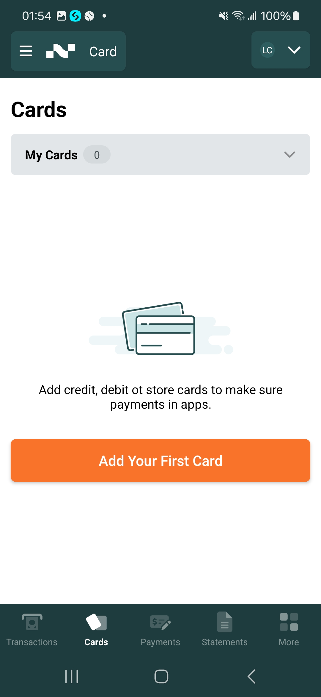
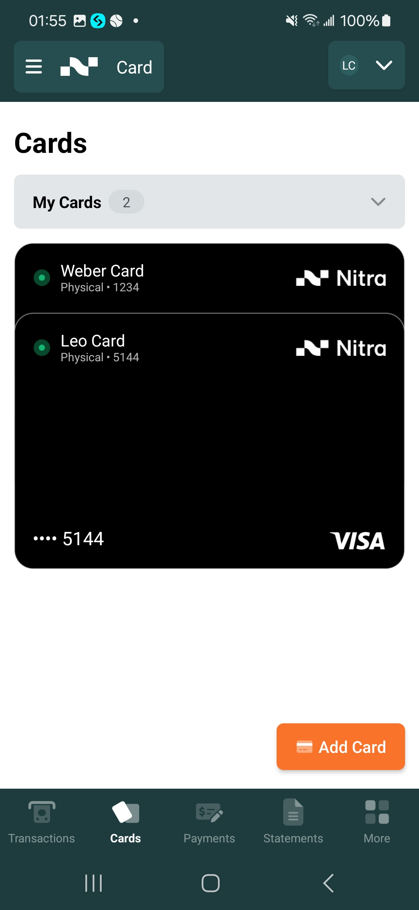
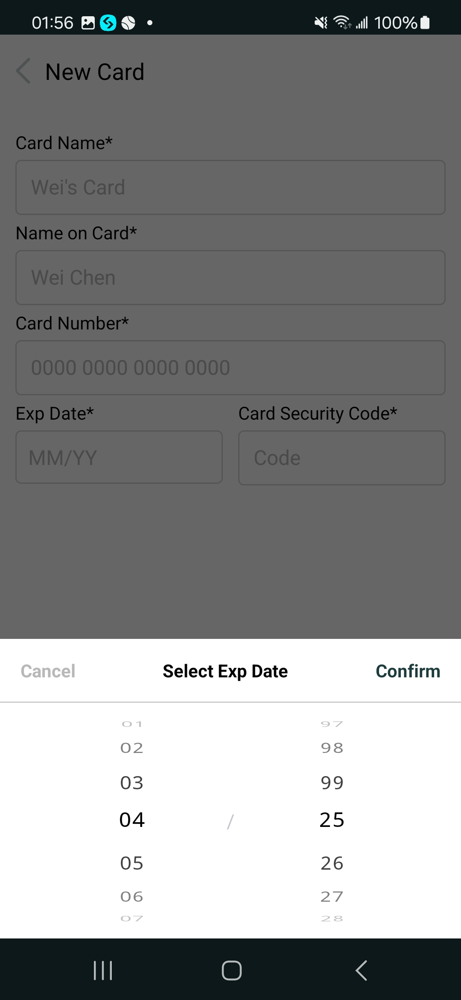
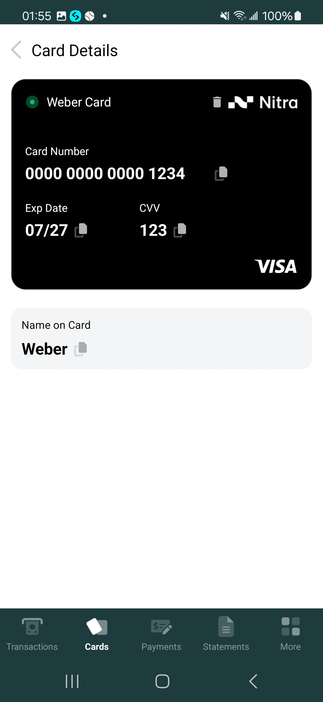
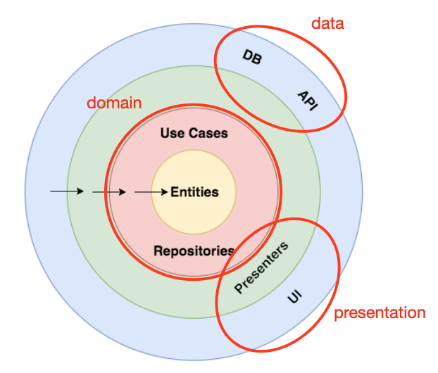

<h1>Demo Cards</h1> 

  
A demo cards app using Hilt based on modern Android tech-stacks and MVVM architecture with Uncle Bob's Clean Architecture approach.  
- A screen that displays a list of cards. (No Card & Many Cards) 
- A form to add a new card with fields and validations for Card Name, Cardholder Name, Card Number, Expiration Date(MM/YY) and CVV Code  
- A details screen to show the selected card’s information. You can edit fields with long click action or delete your card.  
- Mark Card to favorite  
- Reorder by dragging card  

## Screenshots

## Technical Details
- **Kotlin**

- **MultiModule Clean Architecture** which consists of 4 separate modules:
  -  _app_: At the outermost layer of the architecture, depending on all other modules. It is responsible for connecting all modules together and providing the startup and configuration of the application. It has visibility over all the other modules and defines the global dependency injection configurations.
  -  _presentation_: Android module **MVVM**-based. It contains the Android UI framework components (Activities, Fragments, ViewModels...) and the related resources (e.g. images, strings...). This module just observes data coming from the underlying modules and displays it.
  -  _domain_: Kotlin module that contains Use Cases (platform-independent business logic), the Entities (platform-independent business models) and the Repository interfaces.
  -  _data_: It contains Repositories implementation, the Room Entities for persistence. If there is an API request requirement, there are also the data source Api implementations and the corresponding api-specific models.
  - _lib-base_: The library for base usage utilities.

- **Gradle Management** with Version Catalogs enable you to add and maintain dependencies and plugins in a scalable way.

## Tech stack & Open-source libraries
- 100% [Kotlin](https://kotlinlang.org/) based + [Coroutines](https://github.com/Kotlin/kotlinx.coroutines) for asynchronous.
- Hilt for dependency injection.
- JetPack
    - Lifecycle - Lifecycle-aware components perform actions in response to a change in the lifecycle status of another component.
    - ViewModel - UI related data holder, lifecycle aware.
    - Room Persistence - construct database.
- Architecture
    - MVVM Architecture
    - Clean Architecture

- Communication between layers :
  - UI calls method from ViewModel.
  - ViewModel executes Use case.
  - Use case combines data from Repository.
  - Repository returns data from a Data Source (Cached or Remote).
  - Information flows back to the UI.